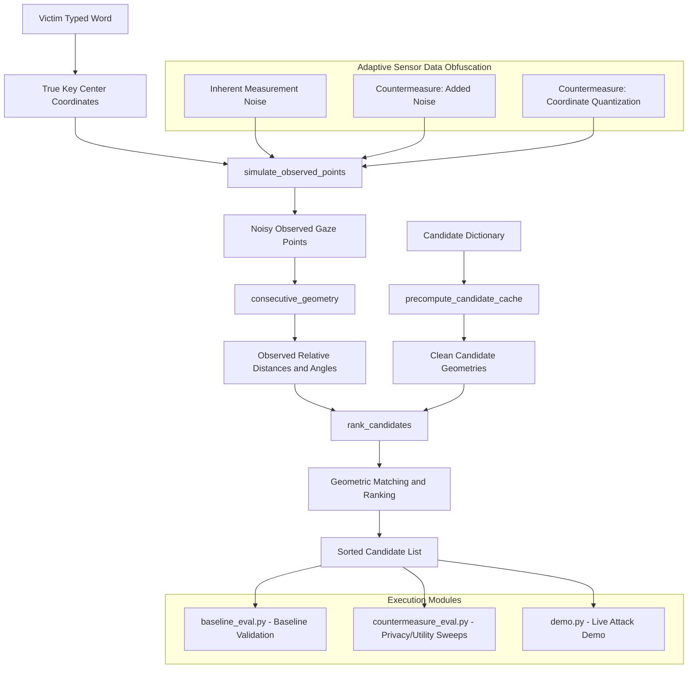
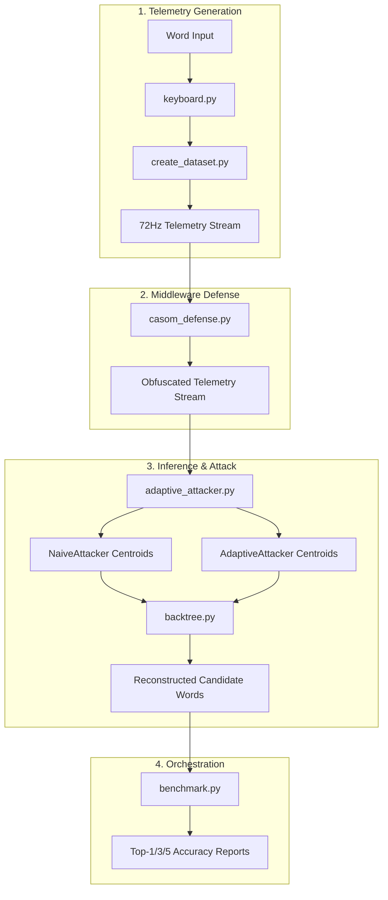

# SNOOPFINGER Reimplementation and CASOM Defense Pipeline

> [!TIP]
> ### Live Interactive Sandboxes
> Experience the real-time virtual keyboard simulator, side-channel sniffer, and CASOM shield defenses directly in your browser:
> - **[Launch Sandbox Dashboard (CASOM v2)](./new.html)**: Interactive QWERTY/AZERTY/QWERTZ layout switcher, decoy typing, and real-time IMU gaze sniffer.
> - **[Launch Explanation & Sandbox (SNOOPFINGER)](./explain.html)**: Step-by-step threat model, KaTeX mathematical equations, and click-to-type keyboard.
> 
> *To run: Simply clone this repository and open either [new.html](./new.html) or [explain.html](./explain.html) in any standard web browser (no local server or compilation required).*

This repository provides a comprehensive Python simulation and evaluation suite for the virtual keyboard gaze-snooping attack and defenses described in:

"Eyes on Your Typing: Snooping Finger Motions on Virtual Keyboards." IEEE Symposium on Security and Privacy (S&P), 2025.

The codebase serves a dual purpose:
1. **Core Attack Evaluation (`snoopfinger_core.py` flow)**: A mathematically equivalent candidate-ranking harness used to run parameter sweeps and quantify the trade-off of the paper's proposed prose countermeasures (coordinate quantization and added Gaussian noise).
2. **End-to-End Simulation Pipeline (CASOM v2 flow)**: A complete, modular simulation chain that generates 72Hz VR gaze telemetry, applies the Context-Aware Sensor Obfuscation Middleware (CASOM) block-offset defense, runs multiple segmentation attackers, and performs BackTree inference.

---

## System Architecture

The suite consists of two distinct evaluation flows.

### Flow 1: Core Attack Evaluation (Privacy/Utility Analysis)
This flow models the mathematical limits of the relative geometry attack against various noise and quantization levels.



### Flow 2: End-to-End CASOM v2 Simulation Pipeline
This flow models a physical VR telemetry generation pipeline, middleware defense insertion, attacker segmentation, and tree-based dictionary search.



---

## File Structure and Modules

### Core Evaluation Suite
* **snoopfinger_core.py**: Keyboard layout configuration, dictionary compilation, and candidate-ranking logic.
* **baseline_eval.py**: Sanity check of the reimplemented attack's behavior against the trend reported in the paper.
* **countermeasure_eval.py**: Main evaluation script that sweeps and measures the efficacy of added noise and coordinate quantization defenses.
* **demo.py**: Interactive or automated demonstration of the attack running against a typed word under different defense states.
* **RESULTS_SUMMARY.md**: Summary of the research gap, proposed solution, and key findings.

### CASOM v2 Simulation Pipeline
* **keyboard.py**: Foundation module defining standard virtual keyboard layouts (QWERTY, AZERTY, QWERTZ) and coordinate mappings.
* **create_dataset.py**: Telemetry generator that uses Fitts' Law for timing and Minimum-Jerk trajectories to generate realistic 72Hz VR head-tracking datasets (outputs CSV data).
* **casom_defense.py**: Context-Aware Sensor Obfuscation Middleware implementing 5 defense modes (`none`, `iid` noise, `drift` noise, coordinate `quant`ization, and `block` offset).
* **adaptive_attacker.py**: Attacker implementations, including a dwell-boundary-aware `AdaptiveAttacker` and a refined spatial/velocity-based clustering `NaiveAttacker`.
* **backtree.py**: Backward Key Inference Tree (BackTree) engine that walks backward from the `enter` key using relative geometry matching and geometric fit error ranking.
* **benchmark.py**: Automated trial orchestrator running 30 trials x 12 words x 5 defenses against both Naive and Adaptive attackers.

### Interactive Web Dashboards
* **explain.html**: A complete interactive presentation explaining SNOOPFINGER's threat model, KaTeX equations, Mermaid workflow, and featuring a click-to-type virtual keyboard simulation sandbox.
* **new.html**: The updated CASOM v2 dashboard demonstrating the block-offset defense and decoy typing shield in real-time.

---

## Installation and Requirements

The suite requires Python 3.7+ along with standard scientific libraries:
- numpy
- matplotlib
- wordfreq

Install dependencies using pip:
```bash
pip install numpy matplotlib wordfreq
```

---

## Execution Guide

### Running Flow 1: Core Evaluation
1. **Validate Baseline Attack**:
   ```bash
   python baseline_eval.py
   ```
   Generates `fig_baseline_accuracy_by_length.png`.

2. **Evaluate Obfuscation Countermeasures**:
   ```bash
   python countermeasure_eval.py
   ```
   Generates `fig_obfuscation_accuracy_curves.png` and `fig_obfuscation_pareto.png`.

3. **Run interactive demo**:
   ```bash
   python demo.py
   ```
   (Or run `python demo.py --auto` for a non-interactive preset simulation run).

### Running Flow 2: CASOM v2 Pipeline
1. **Run Pipeline Benchmark**:
   ```bash
   python benchmark.py
   ```
   This runs the complete pipeline trial suite and outputs detailed accuracy metrics for all 5 defenses against both Naive and Adaptive attackers.

---

## Empirical Benchmark Results

### CASOM v2 Pipeline Benchmark Results
(Generated from `python benchmark.py` over 360 trials per defense configuration):

| Defense Mode | Attacker: Adaptive (Best-Case) Top-1 | Attacker: Naive (Clustering) Top-1 |
|---|---|---|
| **No Defense (Baseline)** | 91.7% | 68.6% |
| **IID Noise (sigma=0.5)** | 90.6% | 37.5% |
| **Drift Noise (sigma=0.3)** | 89.7% | 60.3% |
| **Quantization (step=1.0)** | 91.7% | 63.6% |
| **CASOM Block Offset (sigma=0.5)** | **49.7%** | **0.6%** |

### Key Takeaways
1. **Averaging Vulnerability**: Attacking using dwell-time coordinate averaging (centroids) completely bypasses IID Gaussian noise. Since IID noise is zero-mean, averaging over the dwell frames cancels it to zero (Adaptive Attacker retains 90.6% Top-1 accuracy under IID noise).
2. **CASOM Block Offset Defeated Averaging**: By applying a constant Laplace offset vector within temporal blocks, the noise does not cancel out. This destroys the relative keyboard geometry and drops the Naive Attacker's Top-1 accuracy to **0.6%** and the Adaptive Attacker's accuracy to **49.7%**.
