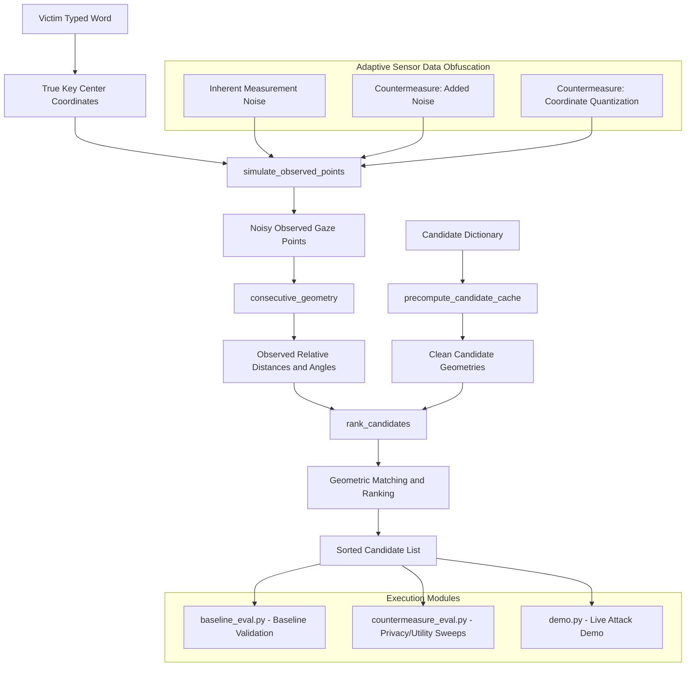

# SNOOPFINGER Reimplementation and Countermeasure Evaluation

This repository provides a from-scratch Python reimplementation of the core attack pipeline described in the paper:

"Eyes on Your Typing: Snooping Finger Motions on Virtual Keyboards." IEEE Symposium on Security and Privacy (S&P), 2025.

It serves as a measurement harness to evaluate "Adaptive Sensor Data Obfuscation" countermeasures (Section 8.2 of the paper), which were proposed in prose but never quantitatively tested in the original work.

---

## Architecture Diagram



---

## Repository Files

* **snoopfinger_core.py**: Keyboard layout configuration, dictionary compilation, and candidate-ranking logic.
* **baseline_eval.py**: Sanity check of the reimplemented attack's behavior against the trend reported in the paper.
* **countermeasure_eval.py**: Main evaluation script that sweeps and measures the efficacy of added noise and coordinate quantization defenses.
* **demo.py**: Interactive or automated demonstration of the attack running against a typed word under different defense states.
* **RESULTS_SUMMARY.md**: Summary of the research gap, proposed solution, and key findings.

---

## Requirements

The codebase requires Python 3.7+ along with the following libraries:
* numpy
* matplotlib
* wordfreq

You can install the dependencies via pip:
```bash
pip install numpy matplotlib wordfreq
```

---

## How to Run

### 1. Run Baseline Evaluation
This script validates the attack ranking against the paper's trend and outputs a comparison graph:
```bash
python baseline_eval.py
```
This saves a plot named `fig_baseline_accuracy_by_length.png`.

### 2. Run Countermeasure Evaluation
This script runs sweeps across different noise levels and quantization steps, outputting accuracy and privacy/utility trade-off curves:
```bash
python countermeasure_eval.py
```
This saves two plots:
* `fig_obfuscation_accuracy_curves.png`
* `fig_obfuscation_pareto.png`

### 3. Run the Demonstration
To run a preset sequence of words non-interactively:
```bash
python demo.py --auto
```
To run interactively where you can type your own words:
```bash
python demo.py
```

---

## Key Findings

1. **Noise injection is highly effective**: Adding measurement noise drives down Top-1 accuracy monotonically and predictably.
2. **Quantization is less effective**: Precision-reduction (coordinate quantization) only degrades the attack when the quantization step approaches or exceeds the key spacing of the keyboard layout.
3. **Privacy-Utility Tradeoff**: At equivalent root-mean-squared error (RMSE) distortion, noise injection provides superior privacy compared to quantization at higher distortion budgets.
